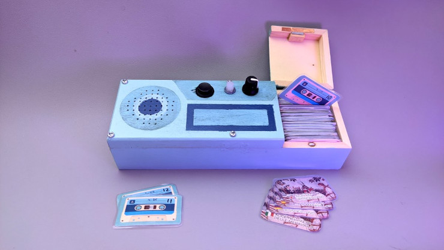
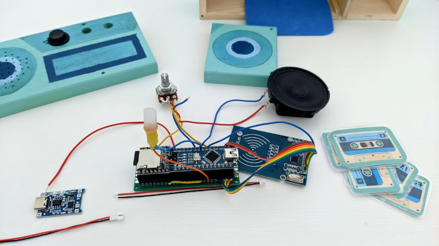
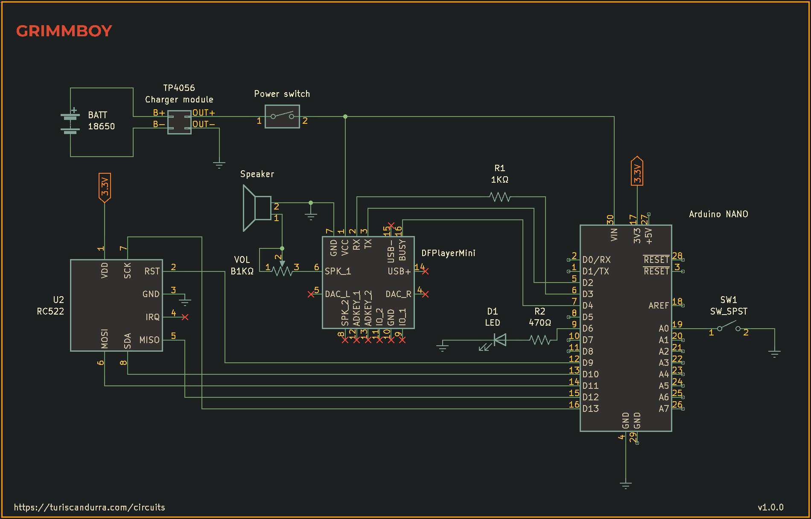

# Grimmboy
## Arduino-controlled kids' audio player

A kids' audio player using an mp3 player chip controlled by an Arduino Nano that's also listening to an RFID reader to trigger the playback of specific tracks.
The controls are limited to one pause/unpause button and a volume knob. There's also a status LED.

The whole setup is powered by a lithium-ion battery, recharged and protected by a TP4056 battery charger module through a common USB-C smartphone charger.

This work is inspired by the open source project [Tonuino]([https://tonuino.de/), compared to which my player has fewer functions but is easier to set up, is battery-powered, and uses a custom data format for the tags so they can be configured using a smartphone.

### BOM
- Arduino Nano or Uno - porting to another microcontroller should be easy
- DFPlayer Mini module
- MFRC522 RFID module
- Ntag213 tags
- microSD card
- TP4056 battery charger module
- 18650 or equivalent lithium battery
- 1K linear potentiometer
- 1K resistor
- 8Ω speaker
- A push-button switch (momentary)
- A rocker or latching switch
- an LED and a resistor

### Required libraries
- [MFRC522](https://github.com/miguelbalboa/rfid/)
- [DFPlayer Mini Fast](https://github.com/PowerBroker2/DFPlayerMini_Fast)
- [Button](https://github.com/madleech/Button)
- [FireTimer](https://github.com/PowerBroker2/FireTimer)

### Creating the tags
Ntag213 tags are also known as MiFare Ultralight C. To write your own tags, use the tool provided named mifareUltralightBatchWriter.ino, or write four-digit, zero-padded track IDs as standard text records using NFC Tools for Android or a similar application.

### Notes
The file system for the SD card should be FAT32.

Encode your mp3s as 44100 Hz, Mono, 32-bit float, VBR.

Even though the mp3 player supports stereo playback, for energy saving reasons I chose to make it mono and include only one speaker.

Place the numbered mp3s in the root of the SD card, and copy the two mp3 files provided into a folder named 'mp3'.

* root/:
    - 0001.mp3
	- 0002.mp3
	- 0003.mp3
	- …
	- mp3/
* root/mp3/:
	- 0001-startup.mp3
	- 0002-error.mp3

### Schematic

The name is a reference to the [Brothers Grimm](https://en.wikipedia.org/wiki/Brothers_Grimm).

Project notes and more info at [turiscandurra.com/circuits](https://turiscandurra.com/circuits)
